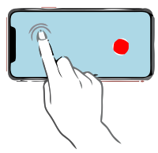

<h1>EMDR</h1>
<h2><em>Online EMDR</em></h2>

<h3>How to use?</h3>
<ol>
<li>
hover your mouse above (or touch) the top-left corner to reveal the 'full-screen button', click it (then another blank part of the screen to remove focus from the button allowing it to hide-itself again).
 

 
You can also simply <strong>double-click the page</strong> (or fast-tap twice for mobile-devices) to switch full-screen ON or OFF.
 

</li>
<li>
(optional) hover your mouse above (or touch) slightly right to where the 'full-screen button' was, to reveal the audio-player, then click the 'play' button to start a 15-minutes binaural-audio, then click something else to remove the focus from the audio-player allowing it to hide-itself again.
 

</li>
<li>
adjust your chair so that your face will be as close to the screen as possible, but make sure you still see everything clear and in-focus.
 

 
If you are using a mobile-device with a screen size about 6Inch try to hold the screen about 5CM from your nose, to maximize the amount of movement the eyes can do,  
if you switch to horizontal/landscape mode please reload the page, and it will be shown better.
 

</li>
<li>
Follow the red-dot with your eyes, keeping your head still, you can focus your mind in either bad or good thoughts, allow the thoughts to stream through your mind without trying to stop them.
</li>
<li>
You descide when you are done. It is recomanded to keep for at least 10-to-15 minutes, 
playing the audio might help you with timing 15-minutes (the audio will loop afterwards).  
<em>When Done -</em> Take a deep breath through your nose and exhale through your mouth.
</li>
</ol>

<h3>More Information (Developers)</h3>

This page does not use cookies, and it does not collect any information.
The page does not require JavaScript unless you want to use the 'full-screen' feature, the audio-player will work even without JavaScript.
The red-dot animation is a pure-CSS animation, it is NOT RANDOM, although it might seen like it is, the reason it looks complex is because the movement uses two <code>cubic-bezier</code> functions one for each x and y axis, controling both the red-dot container and the pseudo-selector <code>::after</code> of the red-dot container, this allows a bit of micro-movement that makes the overall experiance more natural, and hints the direction of the movement, it simulates a movement done by human-hand/fingers as much as possible, the white rim/border around the dot creates the secondary effect of shaddow in the opposite direction of the movement which helps to make the movement slightly more natural, or at least easier to follow.

<h3>Resources Used (Developers)</h3>

I am using https://github.com/richtr/NoSleep.js which is a JavaScript library to simulate a 'wakelock' allowing screen to avoid switching off, and some of the information shown at  http://tobiasahlin.com/blog/curved-path-animations-in-css/ - "Moving along a curved path in CSS with layered animation" by Tobias Ahlin for the smooth CSS-only red-dot movement.

-=-=-=-

202504071856
I was using this tool in various occasions,  
to the point the movement was embedded in my mind,  
I started looking for the right-to-left, or even rotate on axis,  
in various places, mostly cars speeding up from a stop-light,  
it eventually made me a little dizzy or sea-sick.  
the movement is smooth enough so you'll be able to track it,  
with a help of a laser pointer from 1-2 meter while starting the page on a large screen,  
you then try to follow as-fast-as-possible the red-circle with your laser pointer,  
improving your attention to small movement-changes.  
you should be able to track it quite easily, there are micro movement that hint  
for the position the red-circle will be moving.  
it is like a target practice without the need of ammo or time-limit, so no pressure.  
just a practice for FOCUS.  

NOTE.  
even though EMDR works  
this page didn't worked for me (at least for a long time)  
I advise asking, and being treated by a licensed pro, before using this concept.  
there are side-effects!  
mostly, you probably can make it more effective by simply trusting that it will work,  
some call it wishful thinking.  :]

{ hope you will feel better. }  

202504071905  
some of the technical spec.s were changed,  
mostly the keep-screen-aware API.  
you can fork and fix it, or open a bug report (under issues).  

