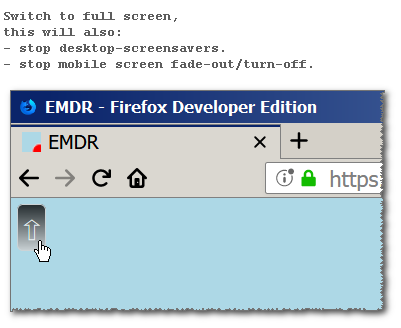
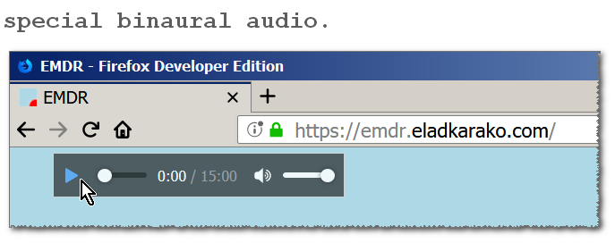

<h1>EMDR</h1>
<h2><em>Online EMDR</em></h2>

<h3>How to use?</h3>
<ol>
<li>
hover your mouse above (or touch) the top-left corner to reveal the 'full-screen button', click it (then another blank part of the screen to remove focus from the button allowing it to hide-itself again).
 

</li>
<li>
(optional) hover your mouse above (or touch) slightly left to where the 'full-screen button' was, to reveal the audio-player, then click the 'play' button to start a 15-minutes binaural-audio, then click something else to remove the focus from the audio-player allowing it to hide-itself again.
 

</li>
<li>
adjust your chair so that your face will be as close to the screen as possible, but make sure you still see everything clear in-focus.
</li>
<li>
follow the red-dot with your eyes, keeping your head still, you can focus your mind in either bad or good thoughts, allow the toughts to stream through your mind an do not try to stop them.
</li>
<li>
you descide when you are done, when you're done, take a deep breath through your nose and exhale through your mouth.
</li>
</ol>

<h3>More Information (Developers)</h3>

This page do not use cookies, and it does not collect any information.
The page do not require JavaScript unless you want to use the 'full-screen' feature, the audio-player will work even without JavaScript.
The red-dot animation is a pure-CSS animation, it is NOT RANDOM, although it might seen like it is, the reason it looks complex is because the movement uses two <code>cubic-bezier</code> functions one for each x and y axis, controling both the red-dot container and the pseudo-selector <code>::after</code> of the red-dot container, this allows a bit of micro-movement that makes the overall experiance more natural, and hints the direction of the movement, it simulates a movement done by human-hand/fingers as much as possible, the white rim/border around the dot creates the secondary effect of shaddow in the opposite direction of the movement which helps to make the movement slightly more natural, or at least easier to follow.

<h3>Resources Used (Developers)</h3>

I am using https://github.com/richtr/NoSleep.js which is a JavaScript library to simulate a 'wakelock' allowing screen to avoid switching off, and some of the information shown at  http://tobiasahlin.com/blog/curved-path-animations-in-css/ - "Moving along a curved path in CSS with layered animation" by Tobias Ahlin for the smooth CSS-only red-dot movement.