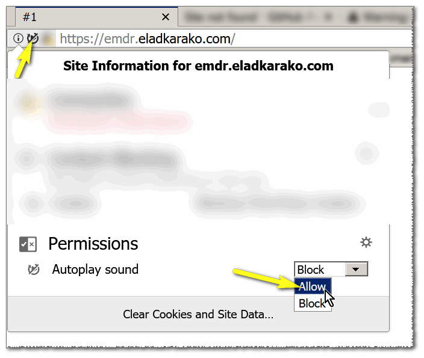
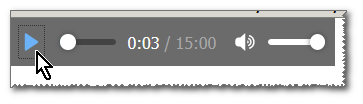

<h1>EMDR</h1>
Online EMDR.

For playing the audio, make sure the auto-play is not-blocked:  
  

Or hover the mouse cursor over the top-left corner and the player will be presented,  
then click the play button.  
  

You can use the keyboard to play/pause the audio (once allowed to play, or after you've clicked the player once),  
using the key <kbd>1</kbd>.  
You can switch the animation to a different one using the key: <kbd>2</kbd> in your keyboard, there are about ~7.  

Each time you'll reload the page you'll get a different animation,  
this functionality is based on a cookie that saves the number of the last-animation.  

The page can operate without the need of JavaScript,  
and without the need of cookies, but in this case you'll need to press the audio-play button yourself,  
and the animation will be just the first one.  